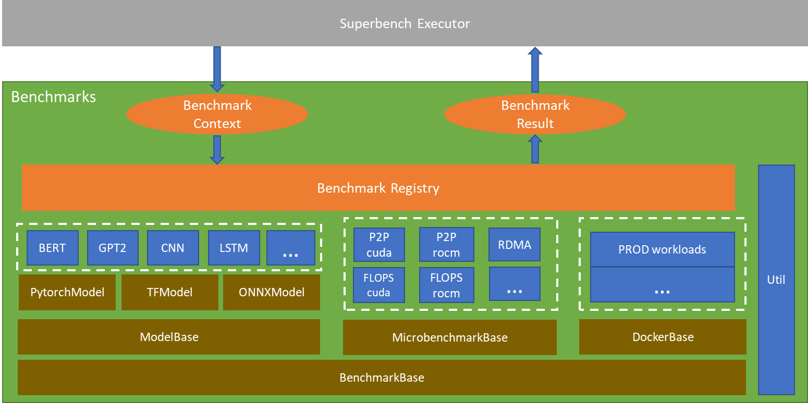
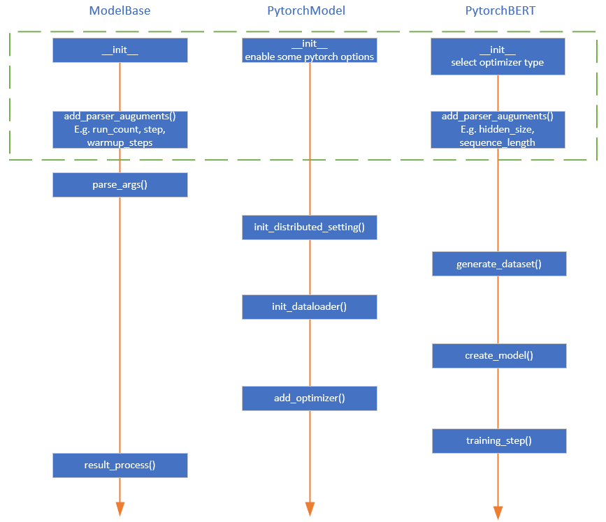
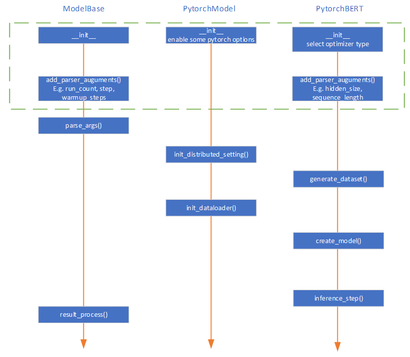
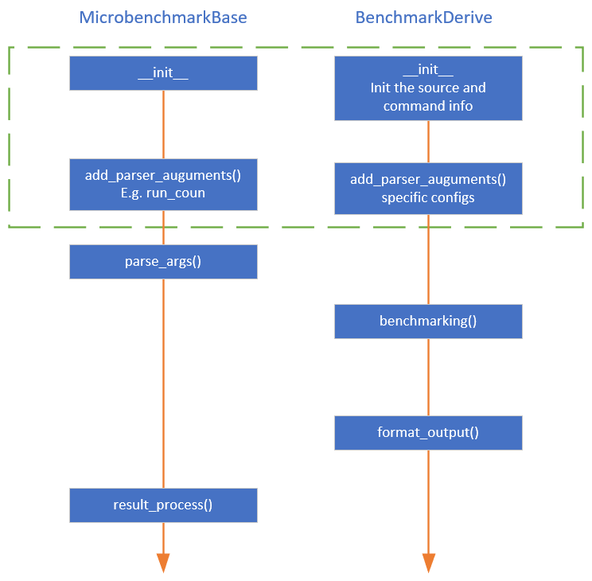

# <!-- omit in toc --> Superbenchmark Benchmarks Abstraction

## <!-- omit in toc -->Table of Content
- [Introduction](#introduction)
  - [Overview](#overview)
  - [Goals](#goals)
- [High-level Technical Design](#high-level-technical-design)
- [Detailed Technical Design](#detailed-technical-design)
  - [ModelBase Benchmarks](#modelbase-benchmarks)
    - [Training](#training)
    - [Inference](#inference)
  - [Micro Benchmarks](#micro-benchmarks)
  - [DockerBase Benchmarks](#dockerbase-benchmarks)
  - [Benchmark Registry](#benchmark-registry)
    - [Design](#design)
    - [Examples](#examples)
- [Interfaces](#interfaces)
  - [Inputs](#inputs)
  - [Invoke](#invoke)
  - [Outputs](#outputs)
    - [Design](#design-1)
    - [Example](#example)
- [Appendix](#appendix)

## Introduction

### Overview

Superbenchark is a benchmark framework that contains lots of useful micro-benchmarks and E2E-benchmarks targeting for hardware/software validation,  performance measurement and offering advice for better resource utilization. For now, Superbenchmark suppert:

Micro-benchmark: FIO, P2P_Bandwidth, TensorCore_Performance, GPU_FLOPS, TCP_Performance, RDMA_Performance, MPI_Performance, NCCL_Performance, Stress_Test.

E2E-benchmark: 32-CNN models, LSTM, BERT, Seq2Seq, DeepSpeech2, NASNet, GraphSage

However the current structure of all the benchmarks are very loose. The pain points we have met are as follows:

1.	Every benchmark has an independent python file and there exist a lot of redundant/dead code. 
2.	To launch one benchmark, we must specify the file path of the benchmark which is hard coded and pieced together with the test name string from config file. 
3.	To add new micro-benchmarks for new accelerators, we must modify the related source code and add IF statement to distinguish different platforms.
4.	To modify some common logic of E2E-benchmarks like Dataset, DataLoader and distributed related code, we need change all the E2E benchmark files.
5.	It’s hard to extended new features, such as running benchmark for N times.
6.	The output of each benchmark is disorganized and unstructured.
7.	Some benchmarks have big variance, it’s hard to do the confirmation and investigation manually.
8.	Hard to detect the interruption of running, especially for microbenchmarks which is launched by system call.

This document will present a new design for the benchmarks to avoid the above pain points. 

### Goals

The new design have the following goals to achieve:

**High Code Quality**
•	Extract the common code into the base class, reduce the workload to maintain all benchmarks.
•	Provide a unified entrance to avoid specifying benchmarks in hard-code way.
**Good Extensibility**
•	Avoid modifying existing code when add new benchmarks by using registration mechanism.
•	Support benchmark-specific configuration, further support models with (same structure and different configs).
**Good Usability**
•	Unify the output format for all the micro-benchmarks and E2E-benchmarks, contains status (success or False), raw-output, error message and structured result.
•	Can specify the run times for user to check the variance of one benchmark.

## High-level Technical Design

The structure of Benchmarks package can be divided into three layers from the bottom up:
1.	Abstract base classes for all kind of benchmarks, including ModelBase, MicrobenchmarkBase and DockerBase.
a)	ModelBase is the base class for all the public E2E models. It defines the abstract interfaces that need to be implemented by the subclasses. It has three subclasses, including PytorchModel, TFModel and ONNXModel. Each subclass will realize part of the abstract interfaces that is common for all models, such as “create_optimizer()”, “init_dataloader()”.
b)	MicrobenchmarkBase is the base class for all the micro benchmarks. It defines the abstract interfaces that need to be implemented by the subclasses, such as “benchmarking()”, “format_output()” and so on.
c)	DockerBase is the base class for real workloads based on docker. It also defines the abstract interfaces that need to be implemented by the subclasses, such as “prepare_image()”, “benchmarking()” and so on.
2.	Derived classes for all implemented benchmarks, realized all the abstract interfaces. The benchmarks will be registered into Benchmark Registry.
3.	Benchmark Registry: provides a way of benchmark registration, maintains all the registered benchmarks and supports benchmark selection by tag, which can be used to select desired benchmark, e.g., use the type of accelerator as the tag.
The Executor on the uppermost layer is the entrance for all the benchmarks, it fetches the benchmark by name from Benchmark Registry, instantiates the benchmark with user configs and launches the benchmark. 
Util provides some utility functions or classes such as RandomDataset generator, accelerator detector.


*Figure 1 Structure of Benchmarks package*

## Detailed Technical Design

This chapter will describe the design details of all the components in Benchmarks package.

### ModelBase Benchmarks

The ModelBase benchmarks have 3-layers Inheritance Relationship. 

#### Training

A complete process of the general training is:

Init_distributed_setting -> create_dataset -> create_dataloader -> create_model -> add_optimizer -> train

The responsibility for function implementation of every layer is as Figure2. The “train” function of ModelBase will execute these functions according to the sequence in the figure. The functions that exist in derived class and not in base class are abstract functions.


*Figure 2 Training process and the responsibility for function implementation of every layer*

#### Inference

A complete process of the general inference is:

Init_distributed_setting -> create_dataset -> create_dataloader -> create_model -> inference

Compared with training, it just gets rid of “add_optimizer()” operation. And the responsibility for function implementation of every layer is as Figure 3. The “inference” function of ModelBase will execute these functions according to the sequence in the figure. The functions that exist in derived class and not in base class are abstract functions.


*Figure 3 Inference process and the responsibility for function implementation of every layer*

### Micro Benchmarks

The micro-benchmarks have 2-layers Inheritance Relationship. And the responsibility for function implementation of every layer is as Figure 4. The functions that exist in derived class and not in base class are abstract functions.


*Figure 4 micro-benchmarks benchmarking process and the responsibility for function implementation of every layer*

### DockerBase Benchmarks

The DockerBase benchmarks have 2-layers Inheritance Relationship. And the responsibility for function implementation of every layer is as Figure 5. The DockerBase benchmarks need docker env ready.


*Figure 5 docker-benchmarks benchmarking process and the responsibility for function implementation of every layer*

### Benchmark Registry

Benchmark Registry is designed to 
1.	Provide a way of benchmark registration.
2.	Avoid modifying existing code when add new benchmarks.
3.	For models that only have different configs, maximize the reuse of code.
4.	Supports benchmark selection by tag, which can be used to select desired benchmark automatically, e.g., use the type of accelerator as the tag.

#### Design

Intefaces are designed as:

```
class BenchmarkRegistry:
    benchmarks = dict()

    @staticmethod
    def register_benchmark(name, class_def, parameters=None, tag=None):
        """
        Args:
            name (str): name of benchmark.
            class_def (Benchmark): class of benchmark.
            parameters (str): parameters of benchmark.
            tag (Platform): Platform types like cuda, rocm.
        """
        pass

    @staticmethod
    def get_benchmark_name_and_parameters(config):
        """
        Args:
            config (object): the benchmark config want to launch.

        Returns:
            name (str): internal benchmark name.
            parameters (str): customized benchmark parameters.
        """
        pass

    @staticmethod
    def check_benchmark_parameters(name, parameters):
        """
        Args:
            name (str): internal benchmark name.
            parameters (str): customized benchmark parameters.

        Returns:
            return true if the customized parameters is valid.
        """
        pass


    @staticmethod
    def launch_benchmark(name, parameters):
        """
        Args:
            name (str): internal benchmark name.
            parameters (str): customized benchmark parameters.

        Returns:
            result object with json format.
        """

    @staticmethod
    def get_benchmark_configurable_settings(name):
        """
        Args:
            name (str): internal benchmark name.

        Returns:
            settings (str): all configurable settings in raw string.
        """
        pass
```

The structure of the BenchmarkRegistry.benchmarks is designed as:

```
dictionary = {   
  'benhmark1': {
    'tag1': (benchmark1_tag1_class, arguments),
    'tag2': (benchmark1_tag2_class, arguments),
  }  
  'benhmark2': {
    'tag1': (benchmark2_tag1_class, arguments),
    'tag2': (benchmark2_tag2_class, arguments),
  }
  ...
}
```

#### Examples

For ModelBase benchmarks:

```
BenchmarkRegistry.register_benchmark('bert-large', PytorchBERT, args='--hidden_size=1024 --num_hidden_layers=24 --num_attention_heads=16 --intermediate_size=4096')
BenchmarkRegistry.register_benchmark('bert-base', PytorchBERT, args='--hidden_size=768 --num_hidden_layers=12 --num_attention_heads=12 --intermediate_size=3072')
```

For Microbenchmark:

```
BenchmarkRegistry.register_benchmark('kernel_launch', KernelLaunchCUDA, tag=Accelerator.cuda)

BenchmarkRegistry.register_benchmark('kernel_launch', KernelLaunchROCm, tag=Accelerator.rocm)
```

## Interfaces

This chapter will describe the interfaces with the caller (Superbench executor), including the input/output format and the invoke method.

### Inputs

The inputs needed by the benchmarks package is simple, just the config object of the benchmark want to run:

### Invoke

```
name, parameters = BenchmarkRegistry.get_benchmark_name_and_parameters(config)
if name:
    valid = BenchmarkRegistry.check_benchmark_parameters(name, parameters)
    if valid:
        result = BenchmarkRegistry.launch_benchmark(name, parameters)
```

### Outputs

#### Design

```
result = {
    'name': 'benchmark_name',
    'errcode: error_code,
'run_count': N,
'start_time': date,
'end_time': date,
    'raw_data': { 
        'metrics1': [[]], # Array for N runs
        ...
        'metricsM' [[]],
    },
    'result': { # Key is metrics, Array for N runs,
        'metrics1': [],
             ...
'metricsM': [],
    },
```

#### Example

Model Benchmarks:

```
result = {
    'name': 'bert-large',
    'errcode': 0,
    'run_count': N,
    'raw_data': {
        'latency-train-float': [[step1_time, step2_time, ...stepM_time], […]],
        'latency-train-half': [[step1_time, step2_time, ...stepM_time], […]],
        'latency-inference-float': [[step1_time, step2_time, ...stepM_time], […]],
        'latency-inference-half': [[step1_time, step2_time, ...stepM_time], […]],
        'throughput-train-float': [[step1_time, step2_time, ...stepM_time], […]],
        'throughput-train-half': [[step1_time, step2_time, ...stepM_time], […]],
        'throughput-inference-float': [[step1_time, step2_time, ...stepM_time], […]],
        'throughput-inference-half': [[step1_time, step2_time, ...stepM_time], […]],
    },
    'result': { # Key is metrics, Array for N runs,
            'latency-train-float': [],
            'latency-train-half': [],
            'latency-inference-float': [],
            'latency-inference-half': [],
            'throughput-train-float': [],
            'throughput-train-half': [],
            'throughput-inference-float': [],
            'throughput-inference-half': [],
    },
```

Micro Benchmarks:

```
result = {
    'name': 'kernel_launch',
    'status': True,
    'run_count': N,
    'raw_data': {
        'raw_output': ['', ''],
    },
    'result': { # Key is metrics
        'latency': [],
    },
```

## Appendix

Document history

|Version|Description|Changer|
|---|---|---|
|Benchmarks package design – v0.1|Draft for review|Guoshuai Zhao|
|Benchmarks package design – v0.2|Modify according to comments. Add more interfaces.|Guoshuai Zhao|
||||
