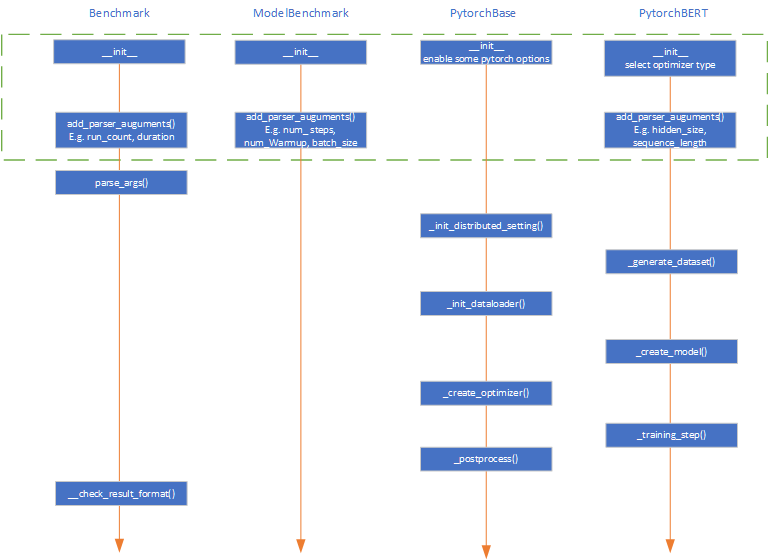
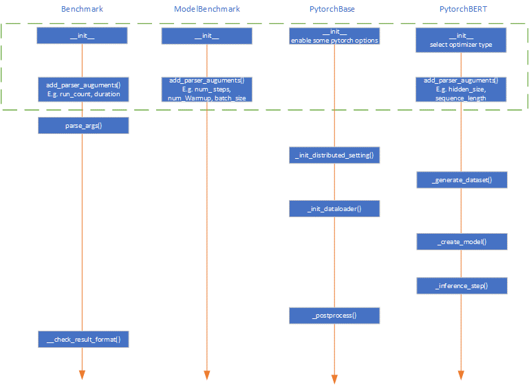
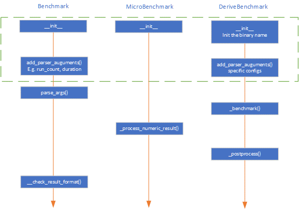
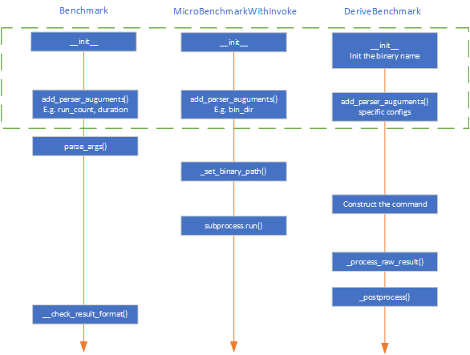
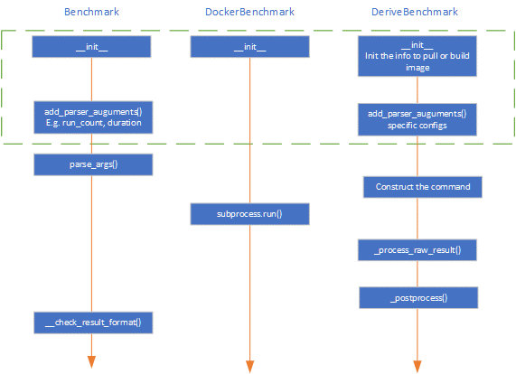

# Benchmarks Design

## Goals

The design of benchmarks has the following goals to achieve:

**High Code Quality**
* Extract the common code into the base class, reduce the workload to maintain all benchmarks.
* Provide a unified entrance to launch benchmarks.

**Good Extensibility**
* Avoid modifying existing code when add new benchmarks by using registration mechanism.
* Support benchmark-specific configuration, further support models with (same structure and different configs).

**Good Usability**
* Unify the output format for all the micro-benchmarks and E2E-benchmarks, contains return_code, metrics, raw-output, etc.
* Can specify the run times for user to check the variance of one benchmark.

## High-level Technical Design


*Figure 1 Structure of Benchmarks package*

The structure of Benchmarks package can be divided into layers from the bottom up:
1. Abstract base classes for all kind of benchmarks, including Benchmark, ModelBenchmark, Microbenchmark and DockerBenchmark.
   1. Benchmark is the base class for all benchmarks. It defines common interfaces such as run(), _preprocess(), _postprocess(), _benchmark(), add_parser_arguments() and so on.
   2. ModelBenchmark is the base class for all E2E models. It defines the abstract interfaces that need to be implemented by the subclasses using different frameworks, such as PytorchBase, TFBase and ONNXBase. Each subclass will realize part of the abstract interfaces that is common for models, such as _init_distributed_setting(), _init_dataloader(), _create_optimizer().
   3. Microbenchmark is the base class for all micro benchmarks. It defines the abstract interfaces that need to be implemented by the subclasses, such as _process_raw_result(), _process_numeric_result().
   4. DockerBenchmark is the base class for real workloads based on docker. It also defines the abstract interfaces that need to be implemented by the subclasses.
2. Derived classes for all implemented benchmarks, realized all the abstract interfaces. The benchmarks will be registered into Benchmark Registry.
3. BenchmarkRegistry: provides a way of benchmark registration, maintains all the registered benchmarks and supports benchmark launching by BenchmarkContext.
4. BenchmarkContext: provides the context to launch one benchmark, including name, parameters, platform(CPU, GPU), framework(Pytorch, TF, ONNX).
5. BenchmarkResult: define the structured result for each benchmark in json format, including name, return_code, start_time, end_time, raw_data, summarized metrics, etc.

The Executor on the uppermost layer is the entrance for all the benchmarks, it launches the benchmark by BenchmarkRegistry and fetch the BenchmarkResult.

## Detailed Technical Design

This chapter will describe the design details of all the components in Benchmarks package.

### E2E Model Benchmarks

The E2E model benchmarks have 4-layers inheritance relationship.

#### Training 

The general process of model training is:

init_distributed_setting -> generate_dataset -> init_dataloader -> create_model -> create_optimizer -> train

The responsibility for function implementation of every layer is as Figure2. These functions will be executed according to the sequence in the figure. The functions that exist in derived class and not in base class are abstract functions.


*Figure 2 Training process and the responsibility for function implementation of every layer*

#### Inference

The general process of the model inference is:

Init_distributed_setting -> generate_dataset -> init_dataloader -> create_model -> inference

Compared with training, it just gets rid of create_optimizer operation. And the responsibility for function implementation of every layer is as Figure 3.


*Figure 3 Inference process and the responsibility for function implementation of every layer*

### Micro Benchmarks

The micro-benchmarks have 3-layers Inheritance Relationship. There have two base class for micro-benchmark: 
One is for pure-python benchmarks named MicroBenchmark. The responsibility for function implementation of every layer is as Figure 4.
Another is for benchmarks depending on third-party executable program named MicroBenchmarkWithInvoke. The responsibility for function implementation of every layer is as Figure 5.


*Figure 4 micro-benchmarks benchmarking process for MicroBenchmark and the responsibility for function implementation of every layer*


*Figure 5 micro-benchmarks benchmarking process for MicroBenchmarkWithInvoke and the responsibility for function implementation of every layer*

### Docker Benchmarks

The Docker benchmarks have 3-layers Inheritance Relationship. And the responsibility for function implementation of every layer is as Figure 6. The DockerBase benchmarks need docker env ready.


*Figure 6 docker-benchmarks benchmarking process and the responsibility for function implementation of every layer*

### Benchmark Registry

Benchmark Registry is designed to
1.	Provide a way of benchmark registration.
2.	Avoid modifying existing code when add new benchmarks.
3.	For models that only have different configs, maximize the reuse of code.
4.	Supports benchmark selection by platform and framework, which can be used to select desired benchmark automatically.

#### Design

Intefaces are designed as:

```
class BenchmarkRegistry:
    benchmarks = dict()

    @classmethod
    def register_benchmark(cls, name, class_def, parameters='', platform=None):
        """Register new benchmark, key is the benchmark name.
        Args:
            name (str): internal name of benchmark.
            class_def (Benchmark): class object of benchmark.
            parameters (str): predefined parameters of benchmark.
            platform (Platform): Platform types like CUDA, ROCM.
        """
        pass

    @classmethod
    def create_benchmark_context(cls, name, platform=Platform.CPU, parameters='', framework=Framework.NONE):
        """Create the benchmark context.
        Args:
            name (str): name of benchmark in config file.
            platform (Platform): Platform types like Platform.CPU, Platform.CUDA, Platform.ROCM.
            parameters (str): predefined parameters of benchmark.
            framework (Framework): Framework types like Framework.PYTORCH, Framework.ONNX.
        Return:
            benchmark_context (BenchmarkContext): the benchmark context.
        """
        pass

    @classmethod
    def get_all_benchmark_predefine_settings(cls):
        """Get all registered benchmarks' predefine settings.
        Return:
            benchmark_params (dict[str, dict]): key is benchmark name,
              value is the dict with structure: {'parameter': default_value}.
        """
        pass


    @classmethod
    def launch_benchmark(cls, benchmark_context):
        """Select and Launch benchmark.
        Args:
            benchmark_context (BenchmarkContext): the benchmark context.
        Return:
            benchmark (Benchmark): the benchmark instance contains all results,
              None means context is invalid or no benchmark is found.
        """
        pass
```

The structure of the BenchmarkRegistry.benchmarks is designed as:

```
dictionary = {
  'benhmark1': {
    'tag1': (benchmark1_tag1_class, predefined_arguments),
    'tag2': (benchmark1_tag2_class, predefined_arguments),
  }
  'benhmark2': {
    'tag1': (benchmark2_tag1_class, predefined_arguments),
    'tag2': (benchmark2_tag2_class, predefined_arguments),
  }
  ...
}
```

#### Examples

For E2E model benchmarks:

```
BenchmarkRegistry.register_benchmark('bert-large', PytorchBERT, args='--hidden_size=1024 --num_hidden_layers=24 --num_attention_heads=16 --intermediate_size=4096')
BenchmarkRegistry.register_benchmark('bert-base', PytorchBERT, args='--hidden_size=768 --num_hidden_layers=12 --num_attention_heads=12 --intermediate_size=3072')
```

For Microbenchmark:

```
BenchmarkRegistry.register_benchmark('kernel-launch', KernelLaunch)
```

## Interfaces

This chapter will describe the interfaces with the caller (Superbench executor), including the input/output format and the invoke method.

### Inputs

The inputs needed by the benchmarks package is simple, just the config object of the benchmark want to run:

### Invoke

```
    context = BenchmarkRegistry.create_benchmark_context(
        benchmark_name, parameters=xxx, framework=xxx, platform=xxx
    )

    benchmark = BenchmarkRegistry.launch_benchmark(context)
    if benchmark:
        logger.info(
            'benchmark: {}, return code: {}, result: {}'.format(
                benchmark.name, benchmark.return_code, benchmark.result
            )
        )
```

### Outputs

#### Design

```
result = {
    'name': 'benchmark_name',
    'type: BenchmarkType,
    'run_count': N,
    'return_code': ReturnCode,
    'start_time': date,
    'end_time': date,
    'raw_data': { # Key is metrics, Array for N runs.
        'metrics1': List[List[Number]] or List[str],
        ...
        'metricsM' List[List[Number]] or List[str],
    },
    'result': { # Key is metrics, Array for N runs,
        'metrics1': List[Number],
             ...
        'metricsM': List[Number],
    },
```

#### Example

Model Benchmarks:

```
result = {
    'name': 'bert-large',
    'type': 'model'
    'run_count': N,
    'return_code': 0,
    'raw_data': {
        'throughput-train-float32': [[step1_time, ..., stepK_time], ..., […]],
        'throughput-train-float16': [[step1_time, ..., stepK_time], ..., […]],
        'throughput-inference-float32': [[step1_time, ..., stepK_time], ..., […]],
        'throughput-inference-float16': [[step1_time, ..., stepK_time], ..., […]]
    },
    'result': {
            'throughput-train-float32': [avg_throughput1, ..., avg_throughputN],
            'throughput-train-float16': [avg_throughput1, ..., avg_throughputN],
            'throughput-inference-float32': [avg_throughput1, ..., avg_throughputN],
            'throughput-inference-float16': [avg_throughput1, ..., avg_throughputN]
    },
```

Micro Benchmarks:

```
result = {
    'name': 'kernel_launch',
    'type': 'micro'
    'run_count': N,
    'return_code': 0,
    'raw_data': {
        'raw_output': [raw_output1, ..., raw_outputN],
    },
    'result': { # Key is metrics
        'overhead': [overhead1, ..., overheadN],
    },
```
