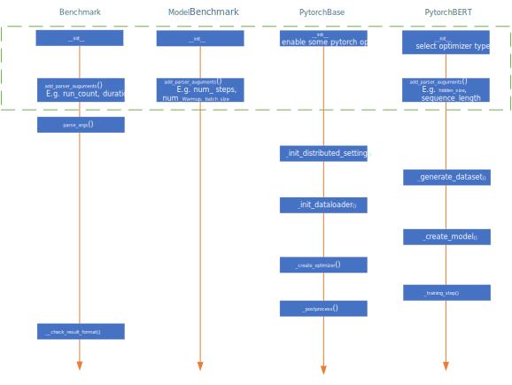
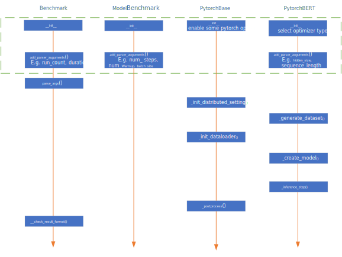
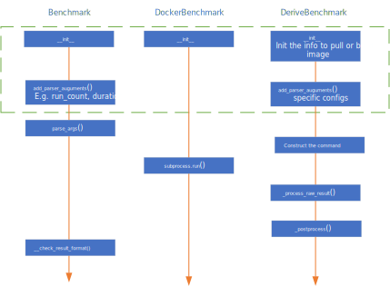

# Benchmarks Design

## Goals

The design of `benchmarks` has the following goals to achieve:

**High Code Quality**
* Extract the common code into the base class, and reduce the efforts to maintain different benchmarks.

**Good Extensibility**
* Avoid modifying existing code when adding new benchmarks by using registration mechanism.
* Support pre-definition of benchmarks' settings, and benchmark registration with different settings.

**Good Usability**
* Provide a unified entrance to launch benchmarks.
* Unify the output format for all the micro-benchmarks and E2E-benchmarks, contains return_code, metrics, raw-output, etc.

## Overall System Design


The structure of `benchmarks` package can be divided into layers from the bottom up:
1. Abstract base classes for all kind of benchmarks, including `Benchmark`, `ModelBenchmark`, `Microbenchmark` and `DockerBenchmark`.
   1. `Benchmark` is the base class for all benchmarks. It defines common interfaces such as `run()`, `_preprocess()`, `_postprocess()`, `_benchmark()`, `add_parser_arguments()` and so on.
   2. `ModelBenchmark` is the base class for all E2E models. It defines the abstract interfaces that need to be implemented by the subclasses using different frameworks, such as `PytorchBase`, `TFBase` and `ONNXBase`. Each subclass will realize part of the abstract interfaces that is common for models, such as `_init_distributed_setting()`, `_init_dataloader()`, `_create_optimizer()`.
   3. `Microbenchmark` is the base class for all micro benchmarks. It defines the abstract interfaces that need to be implemented by the subclasses, such as `_process_raw_result()`, `_process_numeric_result()`.
   4. `DockerBenchmark` is the base class for real workloads based on docker. It also defines the abstract interfaces that need to be implemented by the subclasses.
2. Derived classes for all implemented benchmarks, which need to realize all the abstract interfaces. The benchmarks will be registered into `BenchmarkRegistry`.
3. `BenchmarkRegistry` provides a way of benchmark registration, maintains all the registered benchmarks, and supports benchmark launching by `BenchmarkContext`.
4. `BenchmarkContext` provides the context to launch one benchmark, including name, parameters, platform(CPU, GPU, etc.), and framework(Pytorch, TF, ONNXRuntime, etc.).
5. `BenchmarkResult` defines the structured results for each benchmark in json format, including name, return_code, start_time, end_time, raw_data, summarized metrics, reduce type, etc.

The `Executor` on the uppermost layer is the entrance for all the benchmarks. It launches the benchmark by `BenchmarkRegistry` and fetch `BenchmarkResult`.

## Detailed Component Design

This chapter will describe the design details of all the components in `benchmarks` package.

### E2E Model Benchmarks

The E2E model benchmarks have 4-layer inheritance relationship.

#### Training

The general process of model training is:

> init_distributed_setting -> generate_dataset -> init_dataloader -> create_model -> create_optimizer -> train

These functions will be executed according to the order in the following figure. The functions that exist in derived class but not in base class are abstract functions.



#### Inference

The general process of the model inference is:

> Init_distributed_setting -> generate_dataset -> init_dataloader -> create_model -> inference

Compared with training, it just gets rid of create_optimizer operation.



### Micro Benchmarks

The micro-benchmarks have 3-layer Inheritance Relationship. There are two base classes for micro-benchmark:
`MicroBenchmark` is pure-python benchmark.
`MicroBenchmarkWithInvoke` is benchmark depending on third-party executable program.


### Docker Benchmarks

The Docker benchmarks have 3-layer Inheritance Relationship. The Docker benchmarks need docker env ready.



### BenchmarkRegistry

`BenchmarkRegistry` is designed to
1.	Provide a way to register the benchmark.
2.	Avoid modifying existing code when adding new benchmarks.
3.	Reduce the redundant code for benchmarks with different configurations.
4.	Support benchmark selection by platform and framework, which can be used to select desired benchmark automatically.

#### Design

Intefaces are designed as:

```py
class BenchmarkRegistry:
    benchmarks = dict()

    @classmethod
    def register_benchmark(cls, name, class_def, parameters='', platform=None):
        """Register new benchmark, key is the benchmark name.
        Args:
            name (str): internal name of benchmark.
            class_def (Benchmark): class object of benchmark.
            parameters (str): predefined parameters of benchmark.
            platform (Platform): Platform types like CUDA, ROCM.
        """
        pass

    @classmethod
    def create_benchmark_context(cls, name, platform=Platform.CPU, parameters='', framework=Framework.NONE):
        """Create the benchmark context.
        Args:
            name (str): name of benchmark in config file.
            platform (Platform): Platform types like Platform.CPU, Platform.CUDA, Platform.ROCM.
            parameters (str): predefined parameters of benchmark.
            framework (Framework): Framework types like Framework.PYTORCH, Framework.ONNXRUNTIME.
        Return:
            benchmark_context (BenchmarkContext): the benchmark context.
        """
        pass

    @classmethod
    def get_all_benchmark_predefine_settings(cls):
        """Get all registered benchmarks' predefine settings.
        Return:
            benchmark_params (dict[str, dict]): key is benchmark name,
              value is the dict with structure: {'parameter': default_value}.
        """
        pass


    @classmethod
    def launch_benchmark(cls, benchmark_context):
        """Select and Launch benchmark.
        Args:
            benchmark_context (BenchmarkContext): the benchmark context.
        Return:
            benchmark (Benchmark): the benchmark instance contains all results,
              None means context is invalid or no benchmark is found.
        """
        pass
```

The structure of the BenchmarkRegistry.benchmarks is designed as:

```py
dictionary = {
  'benhmark1': {
    'tag1': (benchmark1_tag1_class, predefined_arguments),
    'tag2': (benchmark1_tag2_class, predefined_arguments),
  },
  'benhmark2': {
    'tag1': (benchmark2_tag1_class, predefined_arguments),
    'tag2': (benchmark2_tag2_class, predefined_arguments),
  },
  ...
}
```

#### Examples

For E2E model benchmarks:

```py
BenchmarkRegistry.register_benchmark('bert-large', PytorchBERT, args='--hidden_size=1024 --num_hidden_layers=24 --num_attention_heads=16 --intermediate_size=4096')
BenchmarkRegistry.register_benchmark('bert-base', PytorchBERT, args='--hidden_size=768 --num_hidden_layers=12 --num_attention_heads=12 --intermediate_size=3072')
```

For Microbenchmark:

```py
BenchmarkRegistry.register_benchmark('kernel-launch', KernelLaunch)
```

## Interfaces

This chapter will describe the interfaces with the caller (Superbench executor), including the input/output format and the invoke method.

### Inputs

The inputs needed by the `benchmarks` package is simple, just the context object of the benchmark want to run:

#### Invoke

```py
    context = BenchmarkRegistry.create_benchmark_context(
        benchmark_name, parameters=xxx, framework=xxx, platform=xxx
    )

    benchmark = BenchmarkRegistry.launch_benchmark(context)
    if benchmark:
        logger.info(
            'benchmark: {}, return code: {}, result: {}'.format(
                benchmark.name, benchmark.return_code, benchmark.result
            )
        )
```

### Outputs

#### Design

```py
result = {
    'name': 'benchmark_name',
    'type: BenchmarkType,
    'run_count': N,
    'return_code': ReturnCode,
    'start_time': date,
    'end_time': date,
    'raw_data': { # Key is metrics, Array for N runs.
        'metrics1': List[List[Number]] or List[str],
        ...
        'metricsM' List[List[Number]] or List[str],
    },
    'result': { # Key is metrics, Array for N runs,
        'metrics1': List[Number],
             ...
        'metricsM': List[Number],
    },
    'reduce_op': {
        'metrics1': ReduceType,
             ...
        'metricsM': ReduceType,
    },
}
```

#### Example

Model Benchmarks:

```py
result = {
    'name': 'bert-large',
    'type': 'model',
    'run_count': N,
    'return_code': 0,
    'raw_data': {
        'fp32_train_throughput': [[step1_throughput, ..., stepK_throughput], ..., […]],
        'fp16_train_throughput': [[step1_throughput, ..., stepK_throughput], ..., […]],
        'fp32_inference_throughput': [[step1_throughput, ..., stepK_throughput], ..., […]],
        'fp16_inference_throughput': [[step1_throughput, ..., stepK_throughput], ..., […]],
    },
    'result': {
            'fp32_train_throughput': [avg_throughput1, ..., avg_throughputN],
            'fp16_train_throughput': [avg_throughput1, ..., avg_throughputN],
            'fp32_inference_throughput': [avg_throughput1, ..., avg_throughputN],
            'fp16_inference_throughput': [avg_throughput1, ..., avg_throughputN],
    },
    'reduce_op': {
        'fp32_train_throughput': 'min',
        'fp16_train_throughput': 'min',
        'fp32_inference_throughput': None,
        'fp16_inference_throughput': None,
    },
}
```

Micro Benchmarks:

```py
result = {
    'name': 'kernel_launch',
    'type': 'micro',
    'run_count': N,
    'return_code': 0,
    'raw_data': {
        'raw_output': [raw_output1, ..., raw_outputN],
    },
    'result': { # Key is metrics
        'overhead': [overhead1, ..., overheadN],
    },
    'reduce_op': {
        'overhead': None,
    },
}
```
