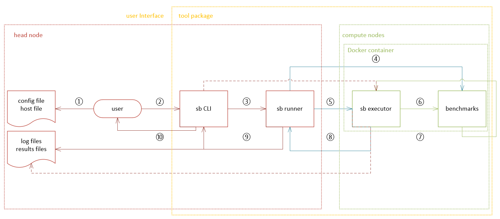

# Superbench Design

## Goals

SuperBench targets on providing a distribution test in cluster with 100 ~ 1000 nodes,
and making it modulable, easy to use and easy to scale up.
Therefore, SuperBench would like to provide a more simple and convenient way to:
1. Install and deploy SuperBench in a raw cluster, including bare-metal, on-premises, and cloud environments.
2. Configure SuperBench configurations, by specifying config file or using command line arguments.
3. Execute the command locally to launch SuperBench on selected devices/nodes or on all nodes in the cluster. Use single device, selected devices, or all devices, including GPU and InfiniBand.
4. Support distributed benchmarks in SuperBench, including NCCL tests using MPI, model performance tests using torch distributed, etc.
5. Collect log during running, save results after running, and merge all nodes' results to one summary report.
6. Provide a unified interface for all benchmarks, including how to run on different device vendor (NVIDIA/AMD), how to run on different mode (local/mpi), how to pass configurations and save results.

## Architecture


## Pipeline



1. User prepares config file and host file. Both files can be omitted by using the default config or command line arguments to specify.
2. User runs SuperBench CLI on head node. Command line interface could accept a set of arguments and provide help information to user.
3. SuperBench CLI parses the input config file, host file, and arguments, loads into one config object, and calls SuperBench Runner to start the test.
4. SuperBench Runner parses the config and execute following steps on all nodes specified in config,
   1. Check the connection.
   2. Check docker environment and SuperBench Docker image.
   3. Start a SuperBench Docker container, and mount necessary paths.
   4. Prepare running context, including local package code, config file, SSH key pairs, SSH config for passwordless use, and distribute to all nodes.
   5. Prepare output path.
   6. Start SSH service and check inter-connections.
5. SuperBench Runner  loops all benchmarks and all modes in each benchmark. For each mode in each benchmark, SuperBench Runner calls SuperBench Executor inside Docker container on corresponding nodes to start an execution.
6. SuperBench Executor parses the config object, start benchmarks inside Docker container one by one.
7. SuperBench Executor gets return code and results of each benchmark once the benchmark finished.
8. SuperBench Executor sends the return code and results back to sb runner. SuperBench Runner Schecks return code and moves to the next execution.
9. Once all benchmarks finished, SuperBench Runner reduces results on all compute nodes, save log and results files, then summarize running results to SuperBench CLI.
10. SuperBench CLI returns the results to the user.

## Components

### SuperBench CLI

SuperBench CLI provides the command-line interface for users to use SuperBench and run related benchmarks.
The CLI provides a set of commands and corresponding help information to users.

### SuperBench Runner

SuperBench Runner is the component to configure environments, prepare context, run benchmarks, collect log from nodes, and summarize results.
It controls the running logic, including when to start, which node or a set of nodes to run, whether a barrier is needed, etc.
SuperBench Runner either communicates with host through SSH to configure running environments and prepare context,
or talk with SuperBench Executor inside Docker container to execute benchmarks and collect log and results on each node.

Here're the details about work directory structure for SuperBench Runner.

```bash
/path/to/working/directory
└── outputs/                                  # output root directory
    └── datetime                              # output directory name in %Y-%m-%d_%H-%M-%S format
        ├── nodes                             # nodes directory
        │   └── node-0                        # output collected from each node
        │       ├── benchmarks                # benchmarks directory
        │       │   └── benchmark-0           # output for each benchmark
        │       │       └── rank-0            # output for each rank in each benchmark
        │       │           ├── results.json  # raw results
        |       |           └── monitor.jsonl # monitor results (optional)
        |       ├── sb-bench.log              # SuperBench benchmarks' runtime log for debugging
        │       └── sb-exec.log               # collected SuperBench Executor log
        ├── sb-run.log                        # SuperBench Runner log
        ├── sb.config.yaml                    # SuperBench configuration snapshot
        ├── mpi_pattern.txt                   # generated host groups file under specified patterns in mpi mode (optional)
        ├── ssh_config                        # generated SSH config file
        ├── id_ed25519                        # generated SSH private key for each run
        └── id_ed25519.pub                    # generated SSH public key for each run
```

### SuperBench Executor

SuperBench Executor is the component to run benchmarks inside Docker container.
It will start the monitor (optional), execute each benchmark and handle all pre- and post-processing, including health check, result validation, result processing, etc.

Here're the SuperBench Executor's work directory structure inside Docker container.
The `/root` directory is mounted from `$HOME/sb-workspace` on the host path.

```bash
/root
├── .ssh                              # SSH directory
│   ├── config                        # generated SSH config file
│   ├── id_ed25519                    # generated SSH private key from Runner
│   └── id_ed25519.pub                # generated SSH public key from Runner
└── outputs/                          # output root directory
    └── datetime                      # output directory name in %Y-%m-%d_%H-%M-%S format
        ├── benchmarks                # benchmarks directory
        │   └── benchmark-0           # output for each benchmark
        │       └── rank-0            # output for each rank in each benchmark
        │           ├── results.json  # raw results
        │           └── monitor.jsonl # monitor results (optional)
        ├── sb.config.yaml            # SuperBench configuration snapshot
        ├── sb-bench.log              # SuperBench benchmarks' runtime log for debugging
        └── sb.env                    # SuperBench runtime environment variables
```

### [Benchmarks](benchmarks.md)

Benchmarks are a set of tests that actually run on node to measure the hardware performance.
Here're the related concepts, nccl benchmark is used as an example.

1. Module

    One benchmark is one module, it has a set of abstract methods that should be implemented, e.g., pre check, measure, post check, save result, etc. The whole nccl benchmark is one module.

2. Mode

    One module may have several modes when running, each mode has corresponding method to run, e.g., local mode is running inside one node, mpi mode is running on all nodes but the command is only executed on one node, pair mode is running between two nodes for every combination, etc. The nccl module may have local mode and mpi mode.

3. Task Group

    One mode may have several task groups to run, each task group has a barrier when running. So only until the task group has finished on all nodes will the next task group start. The mpi mode of nccl module will run all reduce, all gather, etc., each should be treated as one task group.

4. Task

    One task group may contain several tasks to run, there's no barrier needed among these tasks inside one task group.
