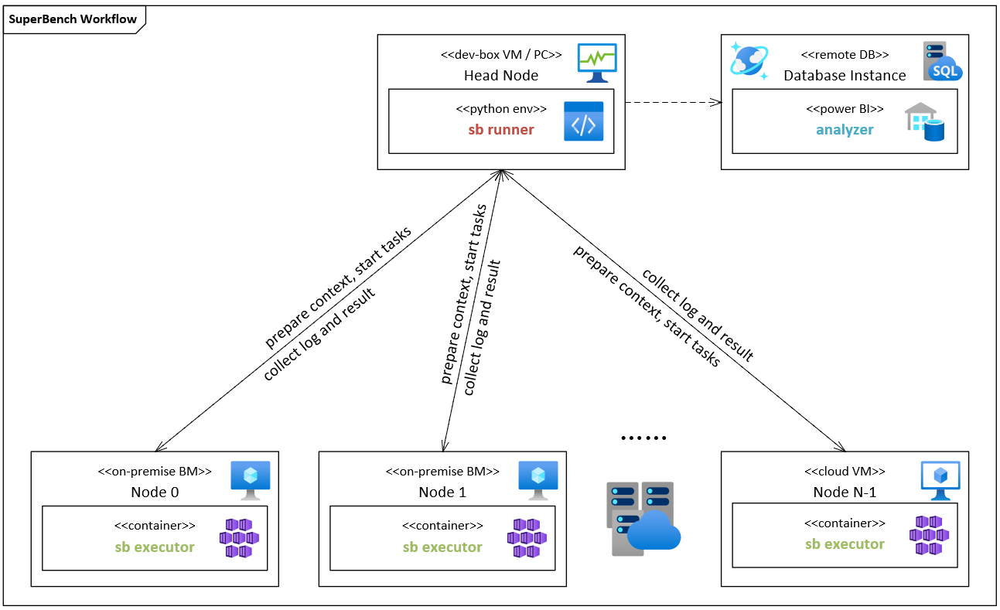

# Superbench Executor Design

## Goals

Extend current tool to fit distribution test needs in cluster with 100 ~ 1000 nodes, make it modulable, easy to use and easy to scale up.
Provide more simple and convenient way to:
1.	Install and deploy the tool in a raw cluster, including bare metal, on-premises, and cloud environments.
2.	Configure super benchmark configurations, by specifying config file or using command line arguments.
3.	Launch super benchmark locally, on selected nodes, or on all nodes in the cluster. Use single device, selected devices, or all devices, including GPU and InfiniBand.
4.	Be able to run with different distribution mode, e.g., mpi, torch distributed, ps/worker or client/server communication, etc.
5.	Collect log during running and save results after running, merge results from all nodes to single one.
6.	Provide a unified interface for all benchmarks, including how to run on different device vendor (NVIDIA/AMD), how to run on different mode (local/mpi), how to pass configurations and save results.

## Design Principle

1.	Make the tool a standard python package in pythonic way.
2.	Only add necessary new features.
3.	Keep frequently used benchmarks at the first stage.
4.	Refactor code structure and internal interfaces, more features/benchmarks to be added in the future.

## Architecture



## Pipeline


1.	User prepares config file and host file. Both files could be omitted and use the default config or command line arguments to specify.
2.	User runs sb cli on head node. Command line interface could accept a set of arguments and provide help information to user.
3.	Sb cli parses the input config file, host file, and arguments, loads into one config object, and calls sb runner to start a run.
4.	Sb runner parses the config object, and for all compute nodes in config,
    1. Check the connection.
    2. Check docker environment and sb Docker image.
    3. Start an sb Docker container, mount necessary paths.
    4. Prepare running context, including local package code, config file, SSH key pairs, SSH config for password less use. Tar all context and distribute to compute node.
    5. Prepare output path.
    6. Start SSH service and check inter-connections.
5.	Sb runner loops all benchmarks and all modes in each benchmark. For each mode in each benchmark, sb runner calls sb executor inside Docker container on corresponding compute nodes to start an execution.
6.	Sb executor parses the config object, start one benchmark inside Docker container.
7.	Sb executor gets return code and results once the benchmark finished.
8.	Sb executor sends the return code and results back to sb runner. Sb runner checks return code and moves to the next execution.
9.	Once finished, sb runner reduces results on all compute nodes, save log and results files, then summarize running results to sb cli.
10.	Sb cli returns what it gets to user.

## Components

### SB CLI

SB cli is a command line interface for end users to use SuperBench tool and run benchmarks. The cli should provide a set of commands and corresponding help information to users. Details will be discussed in [interfaces section](#interfaces).

### SB Runner

SB runner is the component to configure environments, prepare context, run benchmarks, and collect log and results on all compute nodes. It will control the running logic, including when to start, which node or a set of nodes to run, whether a barrier is needed, etc. Sb runner will either communicate with host through SSH to configure running environments and prepare context, or communicate with sb executor inside Docker container to execute benchmarks and collect log and results on each node.

Here’re the details about running context and output structure for sb runner.

**Context**

```
/path/to/working/directory
├── outputs				# log directory
│   └── 2020-12-18_20-43-42		# for each run, name in %Y-%m-%d_%H-%M-%S format
│       ├── config.yaml		# dumped config object for internal use
│       ├── ssh_config		# ~/.ssh/config for all hosts
│       ├── id_rsa			# generated ssh private key for each run 
│       └── id_rsa.pub		# generated ssh public key for each run 
├── superbench				# local superbench code
├── requirements.txt
└── setup.py
```

**Output**

```
/path/to/working/directory
└── outputs				# log directory
    └── 2020-12-18_20-43-42		# for each run, name in %Y-%m-%d_%H-%M-%S format
        ├── sb-run.log		# sb runner log
        ├── node0			# directory for each node
        │   ├── sb-exec.log		# sb executor log for each node
        │   └── benchmarks		# results directory for benchmarks
        │       ├── nccl		# nccl result
        │       ├── pytorch_models	# pytorch models result
        │       └── ...		# others
        └── node...
```

### SB Executor

SB executor is the component to run benchmarks inside Docker container. It will execute each benchmark actually and handle all pre- and post-processing, including health check, result validation, result processing, etc.

Here’re the sb executor’s running context and output structure inside Docker container. The /root directory should be persistent on the host path.

**Context**

```
/root
├── .ssh				# ssh directory
│   ├── config				# ssh_config from sb runner
│   ├── id_rsa				# ssh private key from sb runner 
│   └── id_rsa.pub			# ssh public key from sb runner 
├── outputs				# log directory
│   └── 2020-12-18_20-43-42		# for each run, same as sb runner
│       └── config.yaml		# config object from sb runner
├── superbench				# same superbench code as sb runner
├── requirements.txt
└── setup.py

```

**Output**

```
/root
└── outputs				# log directory
    └── 2020-12-18_20-43-42		# for each run, same as sb runner
        ├── sb-exec.log		# sb executor log
        └── benchmarks		# results directory for benchmarks
            ├── nccl			# nccl result
            ├── pytorch_models	# pytorch models result
            └── ...			# others
```

### Benchmarks

Benchmarks are a set of tests that actually run on compute node to measure the hardware performance. Here’re the related concepts, nccl benchmark is used as an example.

1.	Module

    One benchmark is one module, it has a set of abstract methods that should be implemented, e.g., pre check, measure, post check, save result, etc. The whole nccl benchmark is one module.
2.	Mode

    One module may have several modes when running, each mode has corresponding method to run, e.g., local mode is running inside one node, mpi mode is running on all nodes but the command is only executed on one node, pair mode is running between two nodes for every combination, etc. The nccl module may have local mode and mpi mode.
3.	Task Group

    One mode may have several task groups to run, each task group has a barrier when running. So only until the task group has finished on all nodes will the next task group start. The mpi mode of nccl module will run all reduce, all gather, etc., each should be treated as one task group.
4.	Task

    One task group may contain several tasks to run, there’s no barrier needed among these tasks inside one task group.

## Interfaces

### User Config File

#### Config YAML

```yaml
ansible:
  inventory_file: ./host.yaml
  username: user
  password: pass
superbench:
  docker:
  image: bench.azurecr.io/superbench:cuda11.1
  username: bench
  password: pass
modes:
  local:
    command: "{sb_command}"
  mpi:
    command: "mpirun --allow-run-as-root -np {gpu_num} -H {host_list} -mca pml ob1 --mca btl ^openib -mca btl_tcp_if_exclude lo,docker0 -mca coll_hcoll_enable 0 -x PATH -x LD_LIBRARY_PATH {sb_command}"
  torch.distributed:
    command: "python -m torch.distributed.launch --nproc_per_node={gpu_num_per_node} --nnodes={node_num} --node_rank={node_rank} --master_addr={master_ip} --master_port={master_port} {sb_command}"
  run: [“nccl:local”, “pytorch_models:local”, “pytorch_models:mpi”]
  benchmarks:
  nccl:
    enable: true
    mode: [“local”, “mpi”]
    parameters:
      param: "-b 1M -e 4096M -f 2 -g 1 -c 0"
  pytorch_models:
    enable: true
    mode: [“local”, “mpi”, “torch.distributed”]
    model_name: [“resnet101”, “bert-base”, “bert-large”, “lstm”]
    parameters:
               batch_size: 32

```

### User Host File

#### host.ini

```ini title="host.ini"
[a100]
a100dv0001
a100dv0002
[v100]
v100dv0001
```

#### host.yaml

```yaml title="host.yaml"
all:
  children:
  a100:
    hosts:
      a100dv0001:
      a100dv0002:
  v100:
    hosts:
      v100dv0001:
```

### SB CLI

#### SB Version

**Description**

Print the current SuperBench CLI version.

**Examples**

Print version.
```
$ sb version
```

#### SB Deploy

**Description**

Deploy the SuperBench environments to all given nodes.

**Parameters**
```
--docker-image -i [Required] : Docker image URI.
--docker-password            : Docker registry password if authentication is needed.
--docker-username            : Docker registry username if authentication is needed.
--host-file -f               : Path to Ansible inventory host file.
--host-list -l               : Comma separated host list.
--host-password              : Host password or key passphase if needed.
--host-username              : Host username if needed.
--private-key                : Path to private key if needed.
```

**Examples**

Deploy image "superbench/cuda:11.1" to all nodes in ./host.yaml.
```
$ sb deploy --docker-image superbench/cuda:11.1 --host-file ./host.yaml
```
Deploy image "superbench/rocm:4.0" to node-0 and node-2, using key file id_rsa for ssh.
```
$ sb deploy --docker-image superbench/rocm:4.0 --host-list node-0,node-2 --private-key id_rsa
```

#### SB Run

**Description**

Run the SuperBench benchmarks distributedly.

**Parameters**
```
--docker-image -i [Required] : Docker image URI.
--config-file -c             : Path to SuperBench config file.
--config-override -C         : Extra arguments to override config_file.
--docker-password            : Docker registry password if authentication is needed.
--docker-username            : Docker registry username if authentication is needed.
--host-file -f               : Path to Ansible inventory host file.
--host-list -l               : Comma separated host list.
--host-password              : Host password or key passphase if needed.
--host-username              : Host username if needed.
--private-key                : Path to private key if needed.
```
**Examples**

Run all benchmarks on all nodes in ./host.yaml using image "superbench/cuda:11.1" and default benchmarking configuration.
```
$ sb run --docker-image superbench/cuda:11.1 --host-file ./host.yaml
```
Run all benchmarks on all nodes in ./host.yaml using image "superbench/cuda:11.1", but change the pytorch models batch size to 64.
```
$ sb run --docker-image superbench/cuda:11.1 --host-file ./host.yaml --config-override superbench.benchmarks.pytorch_models.parameters.batch_size=64
```
Run all benchmarks except nccl on all nodes in ./host.yaml using image "superbench/cuda:11.1".
```
$ sb run --docker-image superbench/cuda:11.1 --host-file ./host.yaml --config-override superbench.benchmarks.nccl.enable=false
```

#### SB Exec

**Description**

Execute the SuperBench benchmarks locally.

**Parameters**

```
--docker-image -i [Required] : Docker image URI.
--config-file -c             : Path to SuperBench config file.
--config-override -C         : Extra arguments to override config_file.
--docker-password            : Docker registry password if authentication is needed.
--docker-username            : Docker registry username if authentication is needed.
```

**Examples**

Execute all benchmarks using image "superbench/cuda:11.1" and default benchmarking configuration.
```
$ sb exec --docker-image superbench/cuda:11.1
```
Execute all benchmarks using image "superbench/rocm:4.0" and custom config file ./config.yaml.
```
$ sb exec --docker-image superbench/rocm:4.0 --config-file ./config.yaml
```
Execute all benchmarks using image "superbench/rocm:4.0" and custom config file ./config.yaml, but change the pytorch models batch size to 64.
```
$ sb exec --docker-image superbench/rocm:4.0 --config-file ./config.yaml --config-override superbench.benchmarks.pytorch_models.parameters.batch_size=64
```

## Implementation Choices and Preference

### Provisioning and deployment

Red Hat Ansible is a radically simple IT automation platform that makes your applications and systems easier to deploy and maintain. Automate everything from code deployment to network configuration to cloud management, in a language that approaches plain English, using SSH, without agents to install on remote systems.
* Pros: widely used, support Python API
* Cons: parameters to tune, POSIX only for control node, no real time log

### Configuration Framework

Facebook Hydra is an open-source Python framework that simplifies the development of research and other complex applications. The key feature is the ability to dynamically create a hierarchical configuration by composition and override it through config files and the command line.
* Pros: support both config file and cli args, a rich DSL in command line
* Cons: control argparse, could only be run from `__main__`

### Command Line Interface Framework

Microsoft Knack is a Python command-line interface framework which is used to build Azure CLI and VSTS CLI.
* Pros: Microsoft product, used in az
* Cons: not stable yet

## Reference

1.	Ansible Inventory, https://docs.ansible.com/ansible/latest/user_guide/intro_inventory.html.
2.	Ansible, https://github.com/ansible/ansible.
3.	Ansible runner, https://github.com/ansible/ansible-runner.
4.	Hydra, https://github.com/facebookresearch/hydra.
5.	Knack, https://github.com/microsoft/knack.

## Revision History

| Date | Modifier | Description |
|---|---|---|
|2020-12-19|Yifan Xiong|Initial draft|
|2021-01-14|Yifan Xiong|Revised figures|
|2021-01-19|Yifan Xiong|Revised according to comments|
|2021-03-29|Yifan Xiong|Updated SB CLI part|
||||