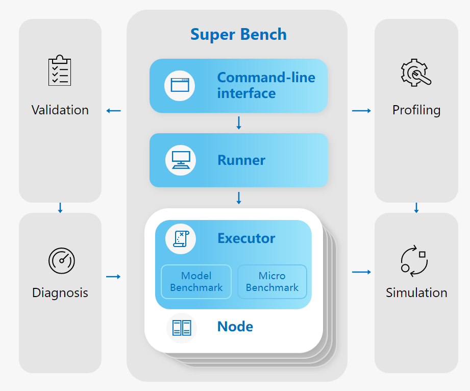

This blog is to introduce [SuperBench](https://github.com/microsoft/superbenchmark) to help you validate AI infrastructure.

We designed and developed SuperBench as a avalidation and profiling tool for AI infrastructure. 
We try our best to create a modular, easy-to-use, standardized, and extensible tool. 
Help users to complete and accurate assessment of AI infrastructure, and bring good user experience.

**SuperBench 0.2.0 Announcement**

We are very happy to announce that **SuperBench 0.2.0 version** is officially released today! 

You can try it by following [Getting Started Tutorial](https://microsoft.github.io/superbenchmark/docs/getting-started/installation)


## The Advantages of SuperBench

### Easy-to-use CLI

In order to achieve one-click deployment, one-click user experience, SuperBench provides a command line interface to help users deploy and run benchmarks. 
Empowered by SuperBench CLI, user can deploy and run their benchmarks with only one command, which greatly shorten the learning time of using tools, 
help user easily evaluate the performance of AI workload.

Below is a simple example to show how to deploy and run benchmarks locally. For more information, 
please view [CLI Document](https://github.com/microsoft/superbenchmark/blob/main/docs/cli.md)

1. Deploy

    ```bash
    sb deploy -f local.ini
    ```
2. Run Benchmark

    ```bash
    sb run -f local.ini -c config.yaml
    ```

Among them, `local.ini` is the configuration file to manage nodes. If you want to run benchmarks locally, the node is `localhost`.

```ini title="local.ini"
[all]
localhost ansible_connection=local
```
`config.yaml` is a config file to configure the details of benchmarkings. You can customize your benchmarks by modified this file.

For more information, please view [confiuration](https://microsoft.github.io/superbenchmark/docs/getting-started/configuration)

### Modular and Extensible Framework

1. Executor Framework

In order to facilitate the benchmarking and validation of large-scale clusters, we designed and implemented a modular and extensible framework. 
SuperBench framework includes a runner as control node, as well as multiple executors as worker nodes. 
A runner received commands from CLI and distribute to all nodes (worker nodes) in the cluster and collect results. 
Worker nodes will execute the specified benchmark tasks.


2. Benchmark Framework

SuperBench supports micro-benchmark for primitive computation and communication benchmarking,
and model-benchmark to measure domain-aware end-to-end deep learning workloads.
SuperBench implemented an abstract BenchmarkBase to provide common fuction, while other benchmarks are plugged-in as components.
It also provides a unified entrance and result format for all benchmarks.
Developers can easily add new benchmarks.


### Conprehensive and Strandardized Benchmarks

SuperBench supports a set of benchmarks listed as below.

* Micro-Benchmarks
  * Computation benchmarks
    * GEMM Flops
    * Kernel Launch Time
    * Operator Performence
    * Memory
  * Communication benchmarks
    * Device P2P
    * RDMA
    * NCCL
  * Computation-Communication Benchmarks
  * Storage Benchmarks

* Model-Benchmarks
  * CNN models
  * LSTM models
  * BERT models
  * GPT-2 models

For the details of each benchmark, please view [micro-benchmarks](https://github.com/microsoft/superbenchmark/blob/main/docs/benchmarks/micro-benchmarks.md) 
and [model-benchmarks](https://github.com/microsoft/superbenchmark/blob/main/docs/benchmarks/model-benchmarks.md).


## What's next?

We want to exend superbench capability to auto-diagnosis and simulation, to build a benchmarking eco-system.
The following figure shows the whole picture.


With SuperBench and its extensions, we can support:

* AI infrastructure validation and diagnosis
  * Distributed validation tools to validate hundreds or thousands of servers automatically
  * Consider both raw hardware and E2E model performance with ML workload patterns
  * Build a contract to identify hardware issues
  * Provide infrastructural-oriented criteria as Performance/Quality Gates for hardware and system release
  * Provide detailed performance report and advanced analysis tool
* AI workload benchmarking and profiling
  * Provide comprehensive performance comparison between different existing hardware
  * Provide insights for hardware and software co-design


## Call for Contributor

This project welcomes contributions and suggestions. 
