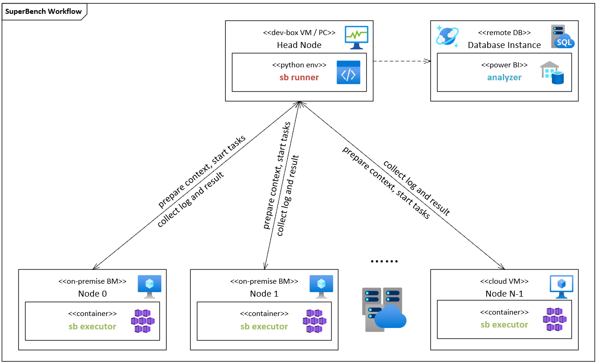
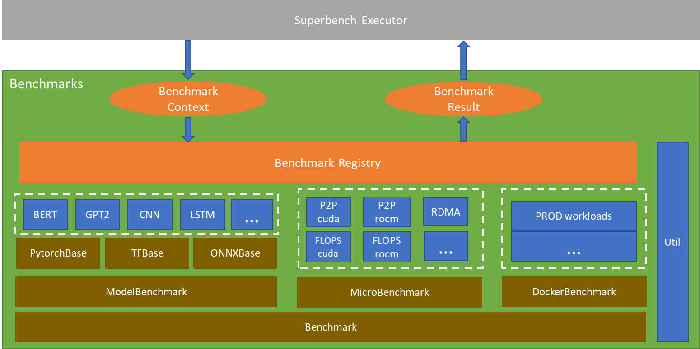
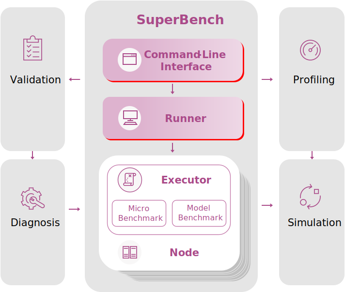

This blog is to introduce [SuperBench](https://github.com/microsoft/superbenchmark) to help you validate AI infrastructure.

## The Advantages of SuperBench

### Easy-to-use CLI

In order to provide good user experience, SuperBench provides a command line interface to help users deploy and run benchmarks.
Empowered by SuperBench CLI, user can deploy and run their benchmarks with only one command, which greatly shorten the learning curve of using tools,
to help user easily evaluate the performance of AI workload.

Below is a simple example to show how to deploy and run benchmarks locally. For more information,
please view [CLI Document](https://microsoft.github.io/superbenchmark/docs/cli)

1. Deploy

    ```bash
    sb deploy -f local.ini
    ```
2. Run Benchmark

    ```bash
    sb run -f local.ini -c config.yaml
    ```

Among them, `local.ini` is the configuration file to manage worker nodes that will actually run benchmarks.
In below case, the worker node is `localhost`, same as control node.

```ini title="local.ini"
[all]
localhost ansible_connection=local
```
`config.yaml` is a config file to configure the details of benchmarkings. You can customize your benchmarks by modified this file.

For more information, please view [configuration](https://microsoft.github.io/superbenchmark/docs/getting-started/configuration)

### Modular and Extensible Framework

1. Executor Framework

  In order to facilitate the benchmarking and validation on large-scale clusters, we designed and implemented a modular and extensible framework.
  SuperBench framework includes a runner as control node, as well as multiple executors as worker nodes.
  A runner received commands from CLI and distribute to all nodes (worker nodes) in the cluster, collect data, and summarize the results.
  Each worker will run executor to execute the specified benchmark tasks.

  

2. Benchmark Framework

  SuperBench supports micro-benchmark for primitive computation and communication benchmarking,
  and model-benchmark to measure domain-aware end-to-end deep learning workloads.
  SuperBench implemented an abstract BenchmarkBase to provide common function. All kind of benchmarks are built based on this abstract class.
  It also provides a unified interface and result format for all benchmarks.
  Developers can easily add new benchmarks.

  

### Conprehensive and Strandardized Benchmarks

SuperBench supports a set of benchmarks listed as below.

* Micro-Benchmarks
  * Computation benchmarks
    * GEMM Flops
    * Kernel Launch Time
    * Operator Performance
  * Communication benchmarks
    * Memory
    * Device P2P
    * RDMA
    * NCCL
  * Computation-Communication Benchmarks
  * Storage Benchmarks

* Model-Benchmarks
  * CNN models
  * LSTM models
  * BERT models
  * GPT-2 models

For the details of each benchmark, please view [micro-benchmarks](https://microsoft.github.io/superbenchmark/docs/benchmarks/micro-benchmarks.md)
and [model-benchmarks](https://microsoft.github.io/superbenchmark/docs/benchmarks/model-benchmarks.md).


## What's next?

We want to extend SuperBench capability to distributed validation and auto-diagnosis, to build a benchmarking eco-system.
The following figure shows the whole picture.


With SuperBench and its extensions, we can support:

* Quick and trustable distributed validation
  * Distributed validation tools to validate hundreds or thousands of servers automatically
  * Provide minute-level fast validation and guarantee high repeatability for each benchmarks
  * Provide baseline for different systems as Performance/Quality Gates for hardware and system release
* Detailed auto diagnosis
  * Provide comprehensive diagnosis benchmarks to analyze the detailed issued on defective node
  * Provide detailed performance report and advanced analysis tool


## Call for Contributor

This project welcomes contributions and suggestions.
